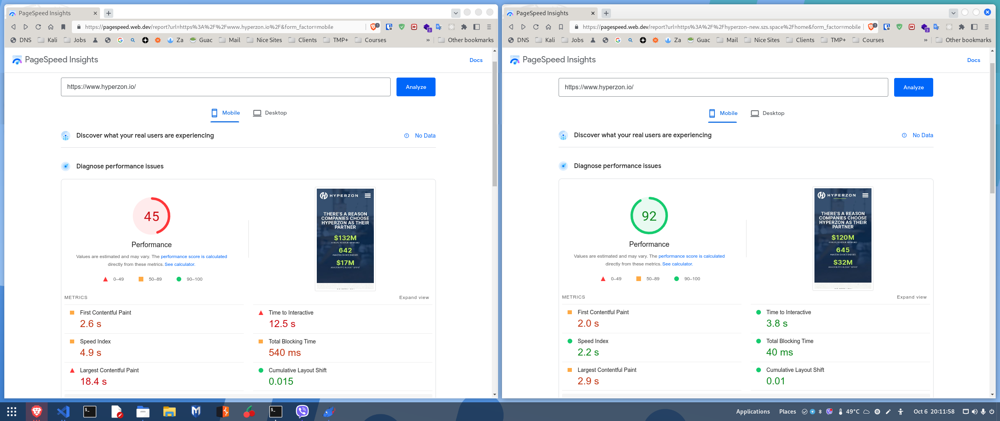

# 

Improving the Hyperzon's site performance and overall user experience.

The customer provided all the assets and the design of the site. Also almost finished frontend of the site, built with HTML5, CSS3 (Less), JavaScript and PHP. They asked me to finish and optimize the frontend of the site. They told me further the site will be re-build with the [CodeIgniter](https://github.com/codeigniter4/CodeIgniter4) PHP MVC framework.

## Performed tasks

* [x] Page speed optimization.
  * [x] Convert all media files in WebP, WebM and other applicable modern formats.
  * [x] Implement lazy loading via HTML5 and/or JavaScript.
  * [x] Minification and uglification of all hosted Fonts, CSS and JavaScript files.
  * [x] Automation of the above process and of the compilation of the Less code.
  * [x] Resource loading prioritization and optimization.
* [x] Finish the frontend of the site:
  * [x] Create responsive blog grid template,
  * [x] Create Single blog post page template.
  * [x] Final touch of the CSS and the overall site responsiveness.
  * [x] Refactoring all JavaScript code.
  * [x] Implement single page application (SPA) conception with pure JavaScript.
  * [ ] Implement photo and video gallery with pure JavaScript.
  * [ ] 
* [x] Browser and OS compatibility optimization.
  * [x] Test the site on all major browsers.
  * [x] Test the site on all major OS.
